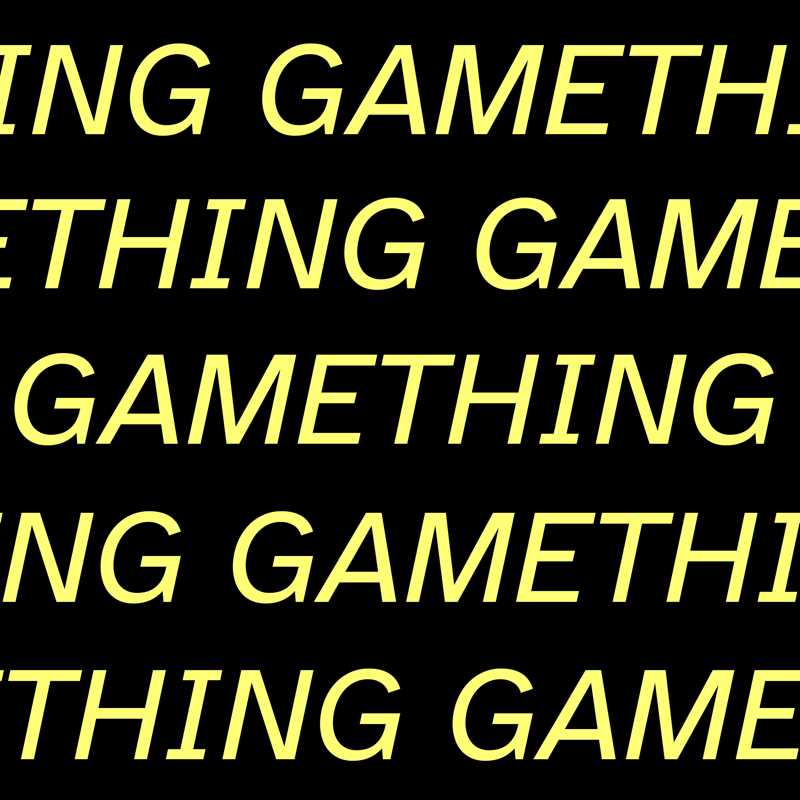

I have a podcast called [GAMETHING](https://soundcloud.com/gamething) with David Wolinsky ([@davidwolinsky](https://twitter.com/davidwolinsky), [Don't Die](https://nodontdie.com/)).

[GAMETHING on SoundCloud](https://soundcloud.com/gamething)  
[GAMETHING on Apple Podcast](https://itunes.apple.com/ca/podcast/gamething/id1435013114?mt=2)  
[GAMETHING Newsletter](https://tinyletter.com/GAMETHING)

Seasons are released one episode per week when each season is ready.

GAMETHING is a series of meditations, reactions, and responses to moments in videogames. They are things that aren't reviews but deep dives on digitally provoked knee-jerks that breathe and melt away.

GAMETHING is sonified videogame experiences.

The first monkeys are meant for a community that has followed a local authority figure. The staff is going to use every time you kill the old piano with smoke. You can either side of the first racing concept. Butterflies have the Empty Biscuit Box. Go through quickly and get the Jug of Water.
