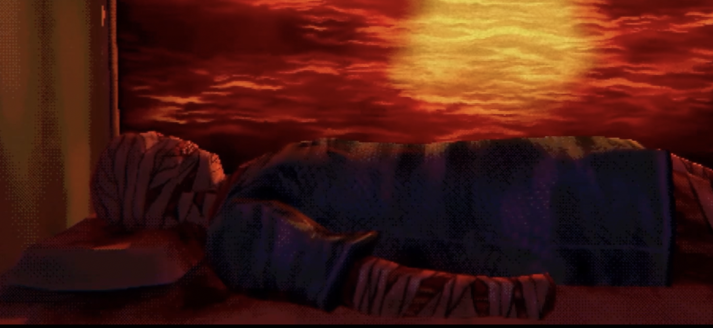

# Mouthwashing's lipless mouth (2025-01-23)

Rilla and I have been playing [*Mouthwashing*](https://www.wrongorgan.com/) on and off for the last while. It's not a long game, we just have drifted in and out of consciousness of it. Haven't finished it, but it's essentially a horror-in-space kind of experience, but horror in the more existential senses, no scrambling away from monsters in the ducts (yet). More of the "you are the monster in the *ducts of your own mind*" style of horror.

Generally speaking, I feel like *Mouthwashing* is a solid game, very confident and leaning on cinematic techniques (most obviously disorienting time jumps and cuts, I guess reminiscent of, say, [Thirty Flights of Loving](https://blendogames.com/thirtyflightsofloving/)). I want to avoid any *spoilers* (the true horror that stalks us all?), but a core element of the game is that the captain (Curly) has been horribly injured - no hands, no feet, burns everywhere, wrapped in bandages, a lone staring circle of an eye, a gross exposed double row of teeth with no lips. He lies in the medical bay and one of the key repeat interactions in the game you have is to give him painkiller pills.

I dwell on that because I think that moment is the game's pinnacle, its main achievement. In the game whenever you want to interact with a person you select them with the cursor to get some kind of zoom-in/camera movement so you're in "I am officially interacting with this person" mode. Then you select their face, usually to talk to them. With Captain Curly you can select his mouth and when you do it opens mechanically with this fairly subtle wet sound. It levers open in a smooth fashion, like a machine, but also like a person who more than anything wants his painkillers on schedule. If you select it again it closes. And that's it. (Well, you can switch to your inventory to select the pills and pop them in, triggering a black-out and sounds of pain and struggle and weeping. I'm less sure about the total success of that bit.)

I think games are often this way, largely conventional, but possessing one odd little superpower, something to dwell on and marvel at. The act of opening and closing this maimed man's lipless mouth is really creepy and awful; but of course it's also caring and dedicated; and it's also mundane and easy; and other things. He used to be your boss. You have played *as* him in the game. But he's also like a child or a trapped animal habituated to captivity. He's gross and vulnerable. It's a bit of a swirl of ideas, and that's why it sticks the landing.

Perhaps most of all it stays with me because of the contrast it has to every other interaction in the game. In a way it underlines how kind of tiring games are with their stripped back set of interactive ideas; in *Mouthwashing* it amounts to moving around and then variations on contextual "do a thing" commands. Most of the time the thing you do is pretty bland stuff like "talk to Daisuke" or "open a door" or "pick up a packet of water" or "begin cutting the birthday cake"; so that moment where "do a thing" corresponds to "open the captain's lipless mouth" (to give him painkillers), it's pretty surprising. It's tender and disgusting in a way that I think is pretty rare. It's a rare loot drop of an interaction. 

Not all "do thing"s are made equal.